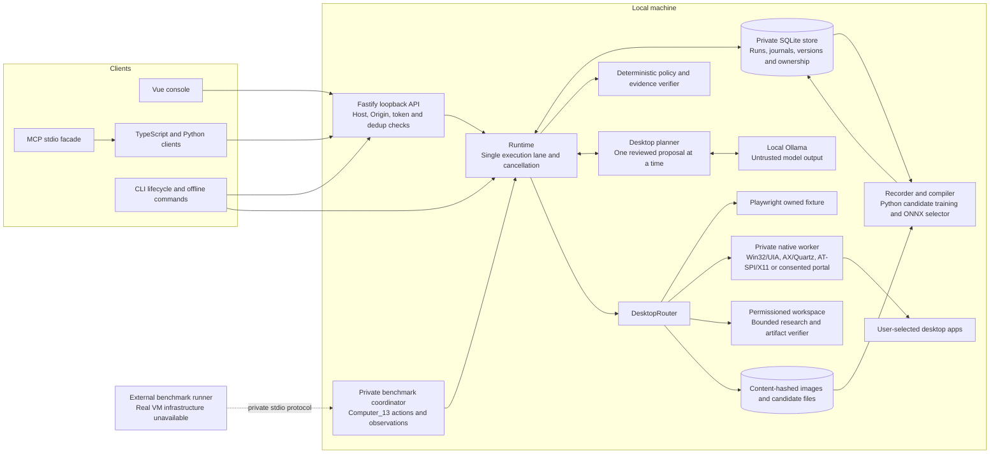

# Architecture and portable execution semantics

This document retains pre-publication execution results. The public edition changes portable training-origin admission and two regression tests. Bundled models need a fresh local qualification against the published source. Read [portable evidence](../docs/open-source/PORTABLE_EVIDENCE.md) for the exact derivative scope.

The separate [interactive system map](../docs/system-map/index.html) traces user journeys, source files, record relationships and the two model systems. See its [opening instructions](../docs/system-map/README.md) and [written trace](../docs/system-map/TRACE.md).

One TypeScript coordinator owns its experience store. The service uses SQLite. The headless library runs without HTTP, Vue, Ollama or either future host application. Fastify and MCP wrap that library. The console uses the public authenticated API.

This describes the repaired working tree over commit `25690943`, fingerprint `31667d67` across 300 maintained files. The source checkpoint preceded publication. [docs/REPAIR_STATUS.md](docs/REPAIR_STATUS.md) records fresh checks and limits. The historical 273-file A-F qualifications and models stay sealed. They do not certify these repairs. Native Mac execution and physical mixed-DPI qualification remain unresolved.



The HTTP token controls access to private state and input. A local model response remains untrusted even though its transport is loopback. Native workers accept private stdio from their parent and independently check input ownership. The store's singleton owner row uses a SQLite write transaction; the PID file supports CLI status and older coordinators. Run creation, its request key and submission event commit together.

```mermaid
sequenceDiagram
  participant User
  participant API as Console and API
  participant Runtime
  participant Store
  participant Model as Local model
  participant OS as Native worker and app
  User->>API: Submit desktop goal and scope
  API->>Store: Persist immutable task and request key
  API->>Runtime: Queue task
  Runtime->>OS: Bind target, acquire, observe, release
  Runtime->>Model: Current controls and optional screenshot
  Model-->>Runtime: Proposed action or answer
  Runtime->>Store: Persist proposal; awaiting_approval
  Runtime-->>User: Show action and evidence
  User->>API: Approve proposal ID
  API->>Runtime: Queue approved action
  Runtime->>OS: Fresh observation
  alt Proposal still matches and policy allows
    Runtime->>Store: Journal dispatch intent
    Runtime->>OS: Execute with lease and deadline
    OS-->>Runtime: Receipt and fresh observation
    Runtime->>Store: Record experience and advance cursor
  else Changed or expired proposal
    Runtime->>Store: Invalidate approval and plan again
  else Delivery uncertain
    Runtime->>Store: reconciliation_required; no replay
  end
  Note over User,Store: A model answer becomes needs_review. User confirmation becomes completed_by_user.
```

For skill execution, objective completion predicates are a separate final check. Successful finalization also requires input cleanup. Failed cleanup keeps a task out of `succeeded`. Paused runs retain their root and child skill hashes. Resume cannot silently resolve a newer version. Candidate test preparation shares the runtime lane, and only the named test run may execute that draft. Ordinary publication checks three journaled successful runs of the exact candidate hash. Controlled causal candidates also need source-bound training, heldout pairs and no-action negative guards. See [ADR 0002](docs/adr/0002-versioned-evidence.md).

Subskill compilation preserves guarded entry and verified return nodes. Caller verification must still be current when recovery is selected. Nested invocation records retain child steps, retries and effect counts through pause and restart. `contracts/delivery.ts` classifies every receipt against its exact action and run. Only explicit, valid `dispatched:false` proves rejected input was not delivered. Uncertain delivery blocks automatic recovery and requires reconciliation.

Workspace permission requires the caller's explicit exclusive ownership of a private root. `tools/workspace-lease.ts` serializes cooperating operations and preserves foreign leases. Opened-file and root identity checks reject replacement. This boundary depends on excluding nonparticipating writers. Model audit finalization writes its signed completion receipt after persistence and cleanup; import and activation reject an incomplete terminal.

```
client goal -> task contract -> skill selection -> validated capsule
 -> XState execution -> permission checks -> environment adapter
 -> receipt -> fresh observation -> independent verification
 -> visual experience -> draft compiler / owned model candidate
 -> tests and audit -> explicit promotion
```

## Module boundaries

`contracts` holds versioned schemas and ports. `runtime` owns execution, cursor persistence and control. `storage` owns SQLite, the coordinator lock and content-hashed artifacts. `compiler` handles intent, demonstration alignment, reusable contiguous subflows, controlled preconditions and bounded drawing programs. `predicates` holds three-valued evidence. `skills` validates capsules, publication evidence and versions. `adapters` supplies browser, native, workspace and benchmark environments. `tools` checks trusted workspace/research grants and explicit retention plans. `providers` handles local language and image input. `recorder`, `learner` and `evaluation` keep recording, training and checking separate.

The runtime accepts structural `ExperienceStore` and `SkillRepository` ports. SQLite `Store` and `Registry` remain the defaults, so service management keeps its token and database access. A trusted embedder can inject a repository that preserves exact hash versions. Browser capture needs only the artifact-writing port. `Run` lives in `contracts/run.ts`, while `storage` re-exports it and the unchanged hash helpers for existing callers. A boundary test rejects host, HTTP, UI and provider imports in the execution core.

`examples/ports` supplies independent JSON implementations without inheriting from Store or Registry. Its real browser tests preserve journals, screenshots and request deduplication, reopen a paused run, and resume the original skill hash after a newer version replaces it. This example supports one trusted coordinator. It requires explicit recovery of a stale ownership file and does not replace the service or learner management APIs.

## Capsule semantics

Version 1 uses JSON data. It has no generated JavaScript, shell snippets or `eval`. The initial state and all targets must exist. A state's ordered steps finish before its first matching guarded transition or default `next` state runs. Each step names a registered operation, immutable arguments or `$parameter` references, a scope, and optional guard, effect predicate, bounded wait or subskill. Cycles spend persisted budgets. Recursive subskill dependencies are rejected, and composition depth is at most eight. Each dependency must be declared, compatible, typed and runnable. The runtime checks required preconditions at entry and before child execution.

XState executes the nodes generated by `src/runtime/program.ts` and an independent deadline monitor. State monitors check fresh facts before and after actions and during waits. Predicate waits poll at 100 ms or slower. Windows collects WinEvent metadata and compares captured changed regions for scoped invalidation; that pipeline has separate development qualification. Unix keeps full target refresh. An event or silence cannot replace necessary current-pixel verification. Explicit `onError` states allow bounded repair before dispatch. `onVerificationError` can select a bounded repair state after independently measured functional failure. A failed or UNKNOWN monitor cannot pass. See [ADR 0004](docs/adr/0004-portable-control-flow.md).

An approved capsule can declare `fresh_observation` recovery within its frozen retry budget. The schema permits zero to five retries; drawing capsules declare three. Runtime retries the same immutable arguments only after an exact action/run-bound rejection whose `dispatched` field is explicitly false. It observes again, assigns a new action ID and repeats the normal policy checks. Every rejected attempt consumes the persisted retry and step budgets. A thrown error, lost reply, UNKNOWN outcome or contradictory receipt cannot enter this recovery path.

Pause and cancellation abort the state machine. The coordinator waits for a bounded in-flight adapter action to settle before releasing its lease. A cursor advances only after the acknowledgment and follow-up observation. A crash after dispatch creates uncertainty. Restart marks interrupted runs for reconciliation. Observation can establish completion or request a new deliberate task. It never assumes rollback.

Failed cleanup records a durable barrier for that host and session. The Runtime checks it before preparing or acquiring a new task. A restarted coordinator requires explicit Return, because a fresh worker has no record of its predecessor's held input. Return acknowledges cleanup for the adapter's owned host and session scopes. It preserves the interrupted task, cursor and uncertainty. Pause and Resume cannot convert that task into replayable work. The barrier applies within one ExperienceStore.

Shutdown, takeover and Return await cleanup of every owned adapter and report all failures. The router cannot skip the native worker because a browser workspace failed. Windows also attempts guarded worker cleanup if its optional capture backend fails. NativeClient requires a held-input release acknowledgment before it reports successful shutdown. Timeout and forced termination remain failures.

## Evidence and learning

Operational acknowledgment is separate from completion. Predicates carry scope, observation identity, freshness, detector version and image references. Missing facts are UNKNOWN. A model assessment has semantic kind and cannot satisfy the objective verifier by itself.

The demonstration compiler aligns related successful sessions by operation and locator. It extracts varying values only when they match task parameters. Shared aligned sequences become segmented machines. `compileWorkflowLibrary` extracts a repeated contiguous program from at least two demonstrated method families into a typed dependency and replaces each matching section with a subskill call. It preserves the ordered effects. Unsupported variation remains rejected or unresolved.

`PreconditionStudy` performs controlled discovery with the actual BrowserAdapter and independent ObjectiveVerifier. At least three varied positive/FALSE pairs must issue the same complete action sequence under the same authorization. Only the measured Boolean condition may differ before each action. Independent heldout pairs, exact candidate positives and false-condition no-action guards precede publication. Registry rechecks immutable source/fixture/protocol hashes, sealed trial journals and a trusted approval. Unknown or uncertain delivery never qualifies. This establishes one resettable fixture profile, not broad causality across arbitrary applications.

The portable skill package layer has an explicit raw capsule version 1 to bundle version 2 migration. Executable SkillCapsule remains version 1. Preview validates without installation; commit retains exact source/bundle artifacts and an immutable receipt. Bundles bind the root and all declared transitive dependency hashes. Import assigns a fresh quarantined hash, clears foreign demonstrations/tests and preserves the original provenance kind and uncertainty reasons. Publication revalidates the candidate and unchanged closure against actual local test journals. Unknown versions/transforms and changed dependency closures fail closed.

The owned CNN/GRU ranks candidate descriptors and has predicate, recovery and outcome/cost heads. Training uses supervised losses with unknown-label masking. The original sealed selector used fixed history. Maintained context versions build request features, remaining budgets and earlier acknowledged actions from the production journal. Visual context uses actual before images; it cannot use the expected answer or post-action facts as policy input. Deterministic permission, compatibility and precondition masks run before ranking.

Read-only owned-model advice exposes qualified predicate/recovery/clarification outputs for its tested profile. It does not authorize input. Outcome/cost forecasts remain unavailable through that read-only route because no legal action was proposed. Candidate head implementation is separate from measured qualification and benefit. Followup protocols and raw evidence live under `evidence/learning-followup-*`; they do not replace the sealed original result or establish general desktop learning.

New stores select `fixed` by default. Training produces candidates and never changes that selection automatically. Qualified V4 browser models use a nonlinear outcome/cost forecast and a tested program template plus dependency closure. A new source qualification replays the selected exposed cases without retraining or reselection. Explicit activation and rollback affect later tasks; existing tasks keep their pinned model. Local preparation, qualification and stopped-store installation are documented in [docs/RUNNING.md](docs/RUNNING.md).

The original audit fixes counts, seeds, observations, baselines and budgets before training. It evaluates live alternative actions, not imagined outcomes from screenshots. The audit model files and raw results are immutable by workflow. Later safety fixes to precondition checks, native capture and UIA did not trigger retuning or replacement of the sealed results. Current source therefore includes post-audit fixes; the archive does not claim a byte-identical snapshot of every source file at audit time.

Training provenance is a separate record. The public origin must match one of three existing reviewed audit tuples and the unchanged selection, protocol, all 22 selected artifacts and six original source files. The fresh audit binds those local evidence bytes without substituting them for current executable source. It still requires the full current source, metrics, seal and cleanup checks. Historical Python files are never executed. [ADR 0006](docs/adr/0006-training-origin-and-deployment-qualification.md) records the decision.

The earlier 300-file V4 qualification and explicit seed-17 activation passed. [The primary receipt](../docs/open-source/EVIDENCE.md) records all three command exits as zero and settled cleanup. [Independent metric review](../docs/open-source/EVIDENCE.md) and [whole-current review](../docs/open-source/EVIDENCE.md) verify all 2,100 tasks, 300 head cases, exact selected weights, current source and signed finalization. [A separate public-operation supplement](../docs/open-source/EVIDENCE.md) completed one browser task with two bound acknowledgments and an independently read result, then rolled back to `fixed`. These are exposed-case source requalification and disposable-Store checks. They do not train new weights, activate the user's Store or establish unseen-task or native learning.

## Native ownership

Rust binds Win32 input to an interactive Windows session and a named mutex. Oculix runs privately through supervised MCP stdio and currently advertises capture only. Its pinned input tools cannot enforce the target and lease at actual dispatch, so the guarded Rust worker executes input. Historical Oculix input smoke results remain historical. Every receipt records its executing backend.

An owned dialog can temporarily supply the current coordinate frame while retaining the root document identity. The Windows adapter checks the root process ID before each capture attempt and before returning. Read-only observation retries use a five-second settling budget and at most twelve attempts. Every returned observation must still satisfy the same pixel, frame, focus and accessibility coherence checks. A failed observation after acknowledged input never replays that input. The native bridge rechecks host, session, window process, foreground, frame, lease, observation age and deadline. Duplicate accessibility IDs do not become unambiguous facts. It does not promise to detect every document replacement inside an unchanged window handle. Background UWP capture is not a reliable image source. The named mutex excludes cooperating runtime clients; arbitrary third-party OS input tools do not participate automatically.

## Integration boundary

External hosts submit tasks and consume ordered evidence. A bridge injects capture, input and ownership operations; it cannot silently change machine identity after reconnect. `BenchmarkEnvironmentAdapter` is a concrete Runtime environment with a private stdio coordinator and Python `CoordinatorProcessBridge`. Only public screenshot/accessibility inputs cross the benchmark boundary. Pixel tracks omit accessibility data. The runner executes returned computer_13 actions and supplies the next observation with the exact action ID. That acknowledges the runner roundtrip. Completion still needs trusted independent public-observation measurement. Emitted actions never replay, and uncertain input stays quarantined until explicit environment reset. Real OSWorld/WindowsAgentArena VMs and scores remain unavailable. External host mapping certification remains separate.

`WorkspaceAdapter` freezes the authorized source, output path and ArtifactSpec before execution. PermissionedTools bounds files, origins, bytes and deadlines. The local model returns literal content. The artifact verifier independently recomputes JSON projections or CSV transforms from the granted source, reports a diff and verifies repaired bytes. Output existence or schema alone cannot complete the task. Attempts, source/config/output hashes and receipts stay in the caller's Store.

Dataset export defaults to redacted fields, per-export identity aliases and placeholder image bytes. Explicit local `unredacted:true` keeps original data for private training or trusted roundtrip tests. Imported labels remain quarantined. Retention has an explicit preview digest and confirmed apply operation for old unreferenced artifacts only. Confirmed deletion intentions and item progress survive restart; live references and protected evidence remain retained.

## General desktop tasks

`DesktopRouter` binds each run to the browser fixture, a selected native window, or `ComputerAdapter` inside the existing Runtime execution lane. Desktop HTTP readers never rebind an active adapter. The native process checks the window's process ID at binding, then checks the observation, frame, focus and input lease at delivery.

Windows uses the Rust bridge. macOS and Linux use a private Python JSONL worker through `UnixAdapter`. macOS reads Accessibility controls, posts Quartz input and captures selected windows with ScreenCaptureKit. Linux uses AT-SPI2; X11 adds XTEST input and window crops. Wayland begins with semantic controls and text; explicit RemoteDesktop/ScreenCast consent adds authorized PipeWire capture and granted input devices. Global coordinates remain limited to the proven scale-1 fullscreen monitor profile. Cached portal pixels keep original timestamps and are display-only. Worker capabilities constrain planning and input. Unix preflight compares fresh controls/content to the submitted observation. Typed preflight rejection is separate from post-dispatch uncertainty. Failed input cleanup retains ownership and quarantine rather than pretending the release completed.

Computer tasks retain an immutable `computer:<session>` target and a separate `activeWindow` binding. Observations include a current app catalog with handle/PID identities. Reviewed `switch_window` and `launch_app` operations use the `navigate` permission. Launching accepts one fixed app ID and no arguments or executable path. The computer adapter checks its own lease and standard policy, then binds ordinary input to the selected native window and native lease generation. The Windows named mutex still excludes other runtime processes. Closing a selected window returns the task to its app catalog. A stale switch proposal expires before input.

`LocalDesktopPlanner` obtains short plans from local Ollama using named current UIA controls, supported control actions and optional PNG screenshots. It retains bounded plan steps in the task store. Each next step binds control names to a fresh observation. Feedback, pause, a changed proposal and new owned dialogs invalidate pending plan context; coordinate actions always require fresh planning. Model suggestions do not enter the published skill registry or training labels.

`driveDesktop` runs under Runtime cancellation and serialization. It persists a proposal, releases the input lease and waits for explicit action review. Approval names one proposal ID. The next drive captures current state, invalidates changed or expired proposals, then uses the standard policy, native lease and action journal. Ambiguous delivery requires reconciliation and cannot retry automatically. Text selections are part of UIA observations. Native cleanup releases only keys and buttons this worker actually holds.

A model answer sets `needs_review`. Human confirmation sets `completed_by_user`, which is distinct from a skill's independently verified `succeeded`. Desktop development checks are in `evaluation/desktop-assistant.ts`, `desktop-console.ts`, `desktop-vision.ts` and `computer-assistant.ts`. The frozen fixture audit and model checkpoints remain unchanged.
