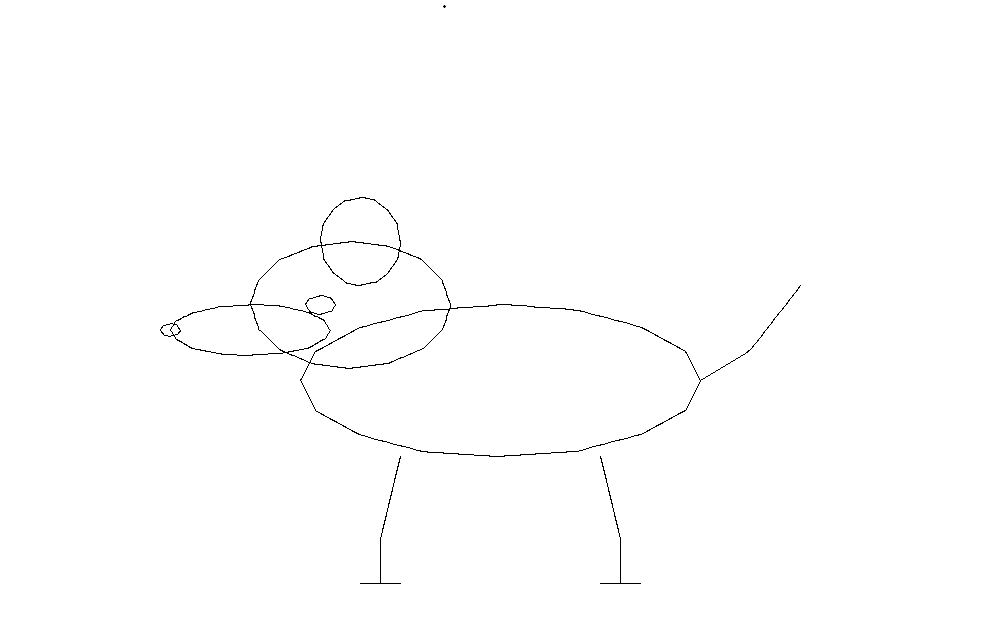

# Use rig-os

Start with the isolated browser fixture. It exercises the service, task history, effect verification, and recording without changing your desktop or loading an Ollama model.

## Install and connect

Install Node 24.17 or later in the 24.x line. Enter `computer-use-runtime` and run one setup command.

Windows:

```powershell
powershell -NoProfile -ExecutionPolicy Bypass -File scripts/setup.ps1
npm.cmd start
```

macOS or Linux:

```sh
sh scripts/setup.sh
npm start
```

Setup installs dependencies and Chromium, builds the application, generates schemas, and runs diagnostics. It needs network access on first installation. Keep the service terminal open. Enter `open`, then `copy`. Paste the token into Local service token in the console and click Connect.

If startup reports that the runtime is already running, use `npm run open` and `npm run token -- --copy` from the shell prompt. Bare `open` and `copy` work inside the original service terminal. In PowerShell, use `npm.cmd` and `npx.cmd` if execution policy blocks npm's PowerShell scripts. The [operating guide](../../computer-use-runtime/docs/RUNNING.md) covers custom stores, native dependencies, permissions, models, backup, and recovery.

## Try the browser fixture

1. Open Runs and keep Structured form contract.
2. Enter a display name and click Run task.
3. Inspect the finished run and evidence. The runtime checks the form's actual saved value.
4. Run two more distinct names if you want to try recording and compilation.

The fixture uses a runtime-owned Playwright browser. The tab displaying the console is a separate client. Fixture success does not qualify a native app or an arbitrary website.

## Use the desktop assistant

Install the requirements for your OS in [PLATFORMS.md](../../computer-use-runtime/PLATFORMS.md), then run:

```sh
npm run setup:desktop
npm run doctor:desktop
```

A Windows build needs Rust and the Visual Studio C++ build tools. This source edition has no precompiled Windows bridge, so run `setup:desktop` before native use. macOS requires Accessibility permission and Screen Recording permission for screenshots. Linux requires the documented packages and desktop-session environment. Wayland global capture/input needs portal consent and currently supports a narrow display profile.

For a local model, install Ollama separately and explicitly download weights. The console discovers models from `127.0.0.1:11434`. Startup never downloads weights. Qwen 3.6 was used for the documented Windows checks. Its installation used about 22.6 GB of disk on a host with 64 GB RAM. That is a tested setup, not a minimum hardware specification.

The model picker also supports Codex CLI and Claude CLI. Install Codex and log in outside rig-os, or install a compatible Claude Code CLI and configure its API key. Then refresh the console. Discovery checks for the fixed client binary. It does not prove authentication, account quota, or access to every listed model. Enter a model your account supports, or use `default` for the CLI's default model. [PROVIDERS.md](../../computer-use-runtime/docs/PROVIDERS.md) has setup and adapter limits.

Choose one to four distinct provider and model pairs. Ordered fallback tries them in selection order and returns the first schema-valid proposal. Parallel ensemble calls all selected providers. Matching proposals can win by agreement. Otherwise a selected provider may choose among the existing proposals, and declared priority settles an invalid or failed selection. This compares model proposals; it does not replace action review or verification.

External CLI providers need explicit consent to receive task text, accessible controls, artifact source data, and any enabled screenshots. Changing a selected model or screenshot setting clears that consent. Ollama stays on loopback and rejects advertised cloud models. Claude CLI is text only in this adapter. Use a capable Ollama model or Codex CLI for screenshot input and canvas assessment. Parallel calls can consume each provider's usage allowance, and selection can add a further model call.

1. Open disposable app state, such as a blank editor document or Calculator.
2. In Desktop, choose This computer, or choose One window and select the app after refreshing open apps.
3. Enter a goal, choose your models and strategy, and review any external-provider consent. For example, ask Calculator to calculate 37 times 14 using its buttons.
4. Click Plan desktop task. Review the proposed action and observation.
5. Click Approve this action to permit that one proposal. Changed or expired observations require a new proposal.
6. When the model reports a result, inspect the app and use Confirm task complete if it is correct.

Human confirmation records `completed_by_user`. A bounded skill with independent effect verification can reach `succeeded`. Free-form tasks do not have an automatic verifier for every possible goal.

Pause task, Cancel task, and Take over interrupt work. Return control retries owned input cleanup. If delivery was uncertain, inspect the app before reconciliation and describe the remaining work. The runtime will not blindly replay the action.

Use your unlocked interactive session. The launcher uses fixed app IDs. The bridge excludes known terminal and credential processes and cannot control UAC or elevated apps. Every proposal needs review, including saves, sends, app switches, and clipboard operations.

## Draw in Paint

Open a blank Paint document that you intend to use for this task. Choose One window, select that Paint window, enter the subject, and choose your providers. Click Plan a bounded Paint drawing. Review the preview and segment count before clicking Approve drawing program. The program can select Pencil and black color, then draw the frozen segments inside the verified canvas. Saving or exporting needs its own approved action.

The development check drew this dog in a separately owned blank Paint window. It acknowledged two setup clicks and 88 drawing segments and measured changed canvas pixels. A human inspected the result. A separate Qwen3.5:4b assessment returned `recognizable: true`, but that opinion is uncalibrated and the task remained `needs_review`.



The [curated repair checks](PROVIDER_REPAIR_CHECKS.json) contain the measured results. This image includes only the owned canvas. Private desktop captures and execution directories stay outside the repository. It does not qualify every drawing subject, model, or desktop app.

## Create a verified artifact

Artifacts accepts pasted JSON/CSV or a permitted public URL. It creates a local task workspace. It does not upload a file to a cloud account or create a chat or project.

Try the default JSON example after choosing a provider. External-provider consent includes the pasted source. Paste:

```json
[{"name":"Alder","quantity":3},{"name":"Birch","quantity":7}]
```

Choose JSON rows and use these output criteria:

```json
[{"name":"name","source":"name"},{"name":"doubleQuantity","source":"quantity","transform":"number","multiply":2}]
```

Click Construct and verify. Expected rows contain Alder with 6 and Birch with 14. The verifier recomputes output from the source. Incorrect output triggers bounded repair; failures stay in history. A model's answer alone cannot complete the task.

Pasted input may contain at most 262144 UTF-8 bytes. Columns support `identity`, `uppercase`, and `number` transforms, plus multiplication. CSV supports quoted fields. URL grants deny private networks, redirects, credentials, and query strings. After success, Preview verified output and download check the exact verified bytes.

## Record and compile a skill

After each successful fixture run, choose Record run. Record three distinct names. In Skills, select those recordings and compile a draft. Inspect its parameters and steps, test it, and publish after local tests pass.

Recordings link observations, receipts, and effects to a run. Corrections can revoke trust. Published skills have immutable hashes; runs pin exact versions and dependencies. Rollback changes the version used by later runs. Imports stay quarantined. A bundle's claimed success does not become trusted local evidence. The [runtime README](../../computer-use-runtime/README.md#record-compile-inspect-and-import) explains bundles and compiler commands.

## Understand learning before enabling it

Selected Ollama or CLI models propose actions or artifact content. The separate Python learner trains a skill-selection controller and exports ONNX. Deterministic policy still decides eligibility and input permission.

Training does not register, qualify, or activate a model automatically. Bundled selected models require local qualification of current source, files, and finalized audit. Activation is separate. Read [qualification and model advice](../../computer-use-runtime/README.md#read-owned-model-advice) first. Keep the qualification directory and private evaluator key outside Git.

Controlled browser qualification passed its exposed cases. A transfer study failed against the authored controller. Neither establishes general desktop learning.

## Use the API, SDK, or MCP

Clients call the same API as the console. GET requests use a bearer token. POST also requires `X-Correlation-ID` and `Idempotency-Key`. Supplied clients add them. A matching request key and payload returns the saved result; changed payload fails. This prevents duplicate submissions, but does not promise exactly-once OS effects.

With the service running, execute the TypeScript fixture example from `computer-use-runtime`:

```powershell
$env:CUR_URL = 'http://127.0.0.1:4317'
$env:CUR_TOKEN_FILE = '.data/service/service.token'
npx.cmd tsx examples/generic.ts
```

macOS or Linux:

```sh
CUR_URL=http://127.0.0.1:4317 CUR_TOKEN_FILE=.data/service/service.token npx tsx examples/generic.ts
```

The [Python client](../../computer-use-runtime/sdk/python/computer_use_runtime.py) and [example](../../computer-use-runtime/examples/agent_os_client.py) use the same service contract. These examples do not prove integration with a separate Agent-OS or Lense installation.

For an MCP host, configure a stdio process with working directory `computer-use-runtime` and command:

```sh
npx tsx src/service/mcp.ts
```

Set `CUR_URL` and `CUR_TOKEN_FILE` in that host's environment. It exposes `runtime_capabilities`, `runtime_submit`, `runtime_status`, and `runtime_control`. The service must already run. MCP does not create another coordinator.

## Stop, update, and keep your data

Enter `stop`, press Ctrl+C, use `npm stop`, or click Shut down runtime. Wait for Runtime stopped. Closing the tab alone leaves the service running. `npm restart` starts the same store again.

The private store defaults to `.data/service`. It holds the database, token, history, screenshots, and artifacts. Stop before backing up the complete directory. Preserve external model and qualification directories separately. Do not commit tokens, recordings, or evaluator keys.

After updates, run `npm run build` and restart. A running backend keeps its loaded code. `npm run dev` starts the front end alone without the runtime API. Run `npm run check` for development verification. The [feature matrix](../../computer-use-runtime/docs/FEATURE_MATRIX.md) and [repair status](../../computer-use-runtime/docs/REPAIR_STATUS.md) preserve failed and unverified gates.
